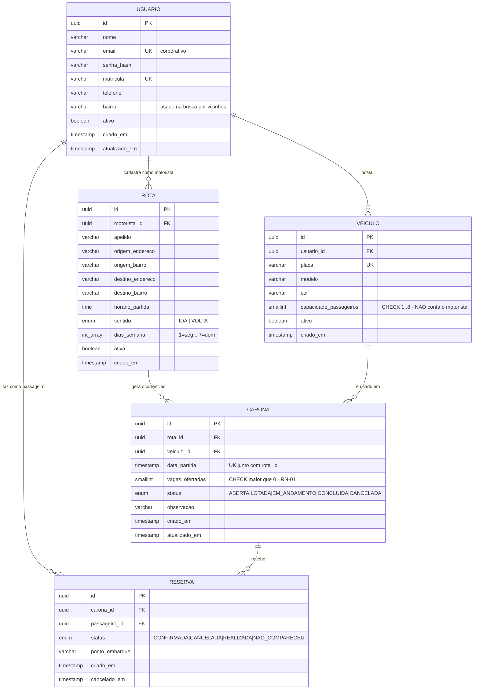
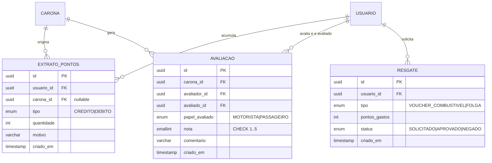

# ViaCar — Modelagem de Dados (DER + Dicionário + Regras de Negócio)

> Case 14 — Gestão de Caronas Corporativas · Equipe Draft
> Responsável: Lucas Rogério Mendonça (Desenvolvedor Backend)
> Banco: PostgreSQL 16 · ORM: Prisma

---

## 1. Decisões de modelagem (leia antes do DER)

### 1.1. Não existe tabela "motorista" nem tabela "passageiro"

Papel é **contextual**, não é tipo de usuário. O mesmo funcionário é motorista na rota que ele criou e passageiro na reserva que ele fez — inclusive no mesmo dia (ida dirigindo, volta de carona). Criar duas tabelas duplicaria cadastro e quebraria o sistema de pontos/avaliação do N2/N3.

### 1.2. `rota` e `carona` são coisas diferentes

O case pede **"cadastro de rotas (origem/destino/horário)"** e **"oferta de vagas no carro"** como itens separados — e são mesmo:

| Conceito | O que é | Frequência |
|---|---|---|
| `rota` | O trajeto recorrente do motorista. "Casa (Costa e Silva) → Empresa, 07:30, seg a sex" | Cadastra 1x |
| `carona` | A viagem concreta de um dia. "Rota X, 15/09/2026 07:30, Civic, 3 vagas" | 1 por dia rodado |

**Por que separar:** sem isso o motorista redigita origem/destino todo dia, e o N2/N3 não tem onde pendurar pontos ("ganhou 10 pts pela viagem de 15/09") nem avaliação ("nota da viagem de 15/09").

**Custo:** +1 tabela, ~2h de trabalho. Se o prazo apertar, o plano B está registrado nos débitos técnicos (DT-06).

### 1.3. `capacidade_passageiros` NÃO inclui o motorista

Um Civic tem 5 lugares, mas `capacidade_passageiros = 4`. Isso elimina a ambiguidade na hora de validar a RN crítica. Fica documentado no schema e no Swagger.

### 1.4. Vagas disponíveis é campo **calculado**, não coluna

`vagas_disponiveis = carona.vagas_ofertadas - COUNT(reservas CONFIRMADA)`

Guardar como coluna criaria duas fontes de verdade e dessincroniza no primeiro cancelamento.

---

## 2. DER

### Índices e constraints não óbvios

| Objeto | Definição | Motivo |
|---|---|---|
| `veiculo` | `CHECK (capacidade_passageiros BETWEEN 1 AND 8)` | Sanidade do domínio |
| `carona` | `UNIQUE (rota_id, data_partida)` | Não duplicar a mesma carona no mesmo dia |
| `carona` | `CHECK (vagas_ofertadas > 0)` | Metade da RN-01 (ver seção 3) |
| `reserva` | `UNIQUE (carona_id, passageiro_id) WHERE status = 'CONFIRMADA'` | Índice **parcial**: bloqueia reserva duplicada, mas permite reservar de novo depois de cancelar |
| `carona` | índice em `(data_partida, status)` | Busca de caronas abertas por data |
| `rota` | índice em `(origem_bairro, destino_bairro, sentido)` | Busca "quem vai do meu bairro pra empresa" |

---

## 3. Regras de negócio

### RN-01 — CRÍTICA (a do case)

> **O motorista não pode oferecer mais vagas no sistema do que a capacidade do seu veículo.**

`carona.vagas_ofertadas <= veiculo.capacidade_passageiros`

Envolve **duas tabelas**, então um `CHECK` simples do Postgres não resolve. Implementação em 2 camadas:

1. **Service (obrigatório, N1):** ao criar/editar carona, carrega o veículo e valida antes de gravar. Erro `422` com mensagem explícita:
   `"Veículo Civic ABC1D23 comporta 4 passageiros; foram oferecidas 6 vagas."`
2. **Banco (desejável):** `TRIGGER BEFORE INSERT OR UPDATE ON carona` com a mesma checagem — garante a regra mesmo em escrita direta no banco (seed, script, próximo grupo).

Se o item 2 não entrar até 16/09, vai pro relatório de débitos técnicos como DT-01.

### RN-02 — Sem overbooking

`COUNT(reservas CONFIRMADA) <= carona.vagas_ofertadas`

Ponto de atenção real: duas reservas simultâneas na última vaga passam as duas se a checagem for ingênua. Implementação: transação com `SELECT ... FOR UPDATE` na linha da carona antes de contar e inserir. **Isso vale menção no pitch** — mostra que o time entendeu concorrência.

### Demais regras

| ID | Regra | Onde valida | HTTP |
|---|---|---|---|
| RN-03 | O veículo usado na carona tem que pertencer ao motorista da rota | service | 403 |
| RN-04 | Motorista não pode reservar vaga na própria carona | service | 422 |
| RN-05 | Não se reserva carona com `data_partida` no passado ou status diferente de `ABERTA` | service | 422 |
| RN-06 | Cancelar reserva libera a vaga: se a carona estava `LOTADA`, volta pra `ABERTA` | service (mesma transação) | 200 |
| RN-07 | Ao atingir o limite de reservas, a carona vira `LOTADA` automaticamente | service | — |
| RN-08 | Cancelar carona cancela em cascata as reservas `CONFIRMADA` | service (transação) | 200 |
| RN-09 | Só o motorista dono da rota edita/cancela a carona | middleware + service | 403 |
| RN-10 | Passageiro não pode ter 2 reservas confirmadas em caronas com horário conflitante | service | 409 |

> RN-10 era a única opcional do N1. **Entrou no D4.** "Horário conflitante" ficou definido como **mesmo dia-calendário e mesmo sentido**: ninguém vai duas vezes para o trabalho na mesma manhã. Comparar janelas de horário seria mais fino e mais frágil — dois carros saindo 07:00 e 07:40 de bairros diferentes continuam sendo uma escolha só, e o segundo motorista ficaria com um lugar vazio. O dia é o dia-calendário **no fuso da empresa**, não em UTC: a carona da volta das 22:00 é 01:00Z do dia seguinte e cairia no dia errado.

---

## 4. Preparado para N2/N3 (modelar agora, implementar depois)

A evolução pedida no case é **acúmulo de pontos** (voucher combustível/folga) e **avaliação de conduta**. Não implemente na N1 — mas deixe o DER pronto, porque isso é exatamente a "instrução para o próximo grupo" que vale 1,0 ponto.

Decisões já tomadas para quem continuar:

- **Saldo de pontos é derivado do extrato** (`SUM` de créditos − débitos), não coluna em `usuario`. Extrato dá auditoria; coluna dá bug de saldo negativo.
- `AVALIACAO` tem `UNIQUE (carona_id, avaliador_id, avaliado_id)` — uma nota por pessoa por viagem.
- Avaliação só é permitida com a carona em `CONCLUIDA` e o avaliador tendo participado dela.
- A tabela `RESERVA` já tem os status `REALIZADA` / `NAO_COMPARECEU` justamente para alimentar pontuação e conduta. **Não removam esses valores do enum.**
